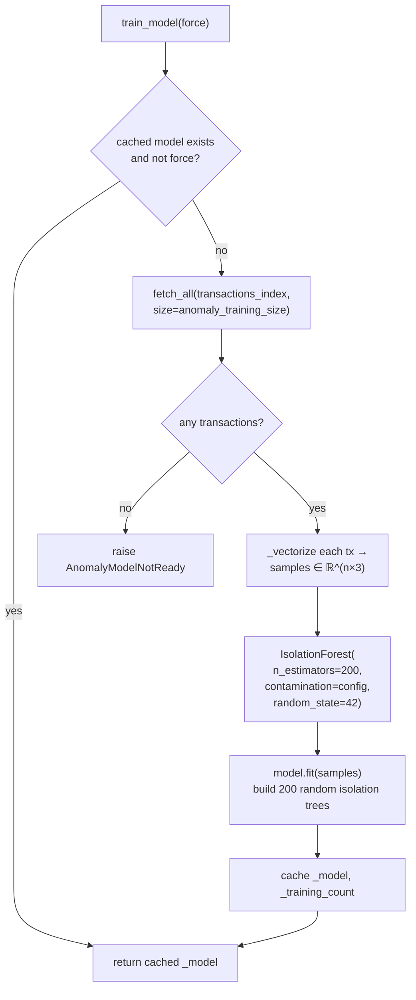
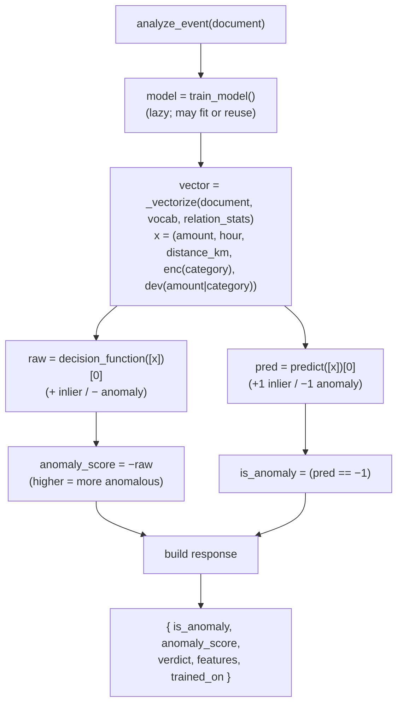

# Anomaly Detection — Mathematical Overview

This document explains how `backend/anomaly_service.py` detects anomalous
financial transactions using an **Isolation Forest**. It covers the feature
representation, the isolation principle, the scoring math, and how the code maps
those quantities onto the API response.

## 1. Feature representation

Every transaction is reduced to a fixed, ordered numeric vector by `_vectorize`:

```
FEATURES             = ("amount", "hour", "distance_km")   # numeric, as-is
CATEGORICAL_FEATURES = ("category",)                       # encoded to an index
RELATIONS            = (("amount", "category"),)           # group-relative deviation
```

So a document is projected to a point in ℝ⁵:

$$
\mathbf{x} = (\text{amount},\; \text{hour},\; \text{distance\_km},\; \text{enc}(\text{category}),\; \text{dev}(\text{amount} \mid \text{category})) \in \mathbb{R}^5
$$

**Categorical encoding.** The categorical `category` is encoded to a number by
`enc`: the distinct category values seen **at training time** are sorted
lexically, and each value maps to its 0-based position in that sorted list (its
*vocabulary index*). A value not seen during training encodes to `-1`.

**Relations (contextual features).** Each pair in `RELATIONS` connects a numeric
feature to a grouping feature and emits one *group-relative deviation*. For
`("amount", "category")`, `dev` is a **robust z-score** of the amount within its
category:

$$
\text{dev}(\text{amount} \mid \text{category} = g) = \frac{\text{amount} - m_g}{1.4826 \cdot \text{MAD}_g}
$$

where $m_g$ is the median amount of group $g$ and $\text{MAD}_g$ its median
absolute deviation, both computed **at training time**. Median/MAD (not
mean/std) is used deliberately: it is robust, so a few outliers mixed into the
training data cannot inflate a group's baseline and mask genuine anomalies. This
is the axis that lets the forest catch *contextual* anomalies — an amount that is
normal globally but wrong **for its category** (e.g. a €10 `wages` payment) — which
are invisible on the raw `amount` axis. A group unseen at training time falls
back to a global baseline; the $1.4826$ constant rescales the MAD to a
standard-deviation estimate under a normal distribution.

Both the vocabulary and the per-group relation baselines are built once per
(re)train and cached alongside the model, so training and scoring stay in sync.

All other fields (timestamp, …) are **ignored** for scoring, any missing or
non-numeric numeric feature is coerced to `0.0`, a missing category encodes to
`-1`, and a relation with a missing value contributes `0.0` (on-baseline). The
feature order is part of the contract: it must be identical during training and
scoring.

> **Caveat — single-axis dilution.** The forest weights all axes equally, so a
> contextual anomaly that is extreme on *only* the relation axis (and average on
> the raw `amount`, `hour`, `distance_km` axes) is partly averaged out. The
> relation makes such a point far more anomalous than before, but with the raw
> `amount` axis still present it may land just inside the `contamination`
> boundary. Levers: drop the now-redundant raw feature that the relation
> supersedes, raise `contamination`, or add more discriminating relations.

The synthetic data (`seed_transactions.py`) is constructed so the two classes
are separable on exactly these axes:

| Feature       | Normal transaction | Anomalous transaction |
| ------------- | ------------------ | --------------------- |
| `amount`      | 5 – 250            | 3 000 – 25 000        |
| `hour`        | 7 – 21             | 0 – 4 (small hours)   |
| `distance_km` | 0 – 30             | 500 – 8 000           |

Anomalies are extreme on at least one axis, which is precisely the structure an
Isolation Forest exploits.

## 2. The isolation principle

An Isolation Forest is an **ensemble of random binary trees** (`n_estimators = 200`
in the code). Each *isolation tree* is grown by recursively partitioning the data:

1. Pick a feature $q$ uniformly at random from the 5 features.
2. Pick a split value $p$ uniformly at random between the min and max of $q$
   in the current node.
3. Send points with $x_q < p$ left and the rest right.
4. Repeat until each point is isolated in its own leaf (or a height limit is hit).

The key insight: **anomalies are "few and different", so they get isolated with
fewer random splits.** A point far out on the `amount` or `distance_km` axis is
likely to be cut off from the dense cluster of normal points after just one or
two splits, giving it a **short path length** from the root. Normal points sit
in dense regions and require many splits to isolate, giving **long path lengths**.

Let $h(\mathbf{x})$ be the path length (number of edges from the root to the leaf
that isolates $\mathbf{x}$) in a single tree, and $E[h(\mathbf{x})]$ its average
across all trees in the forest.

## 3. The anomaly score

To make path lengths comparable across sample sizes, they are normalized by the
average path length of an unsuccessful search in a Binary Search Tree over $n$
points:

$$
c(n) = 2H(n-1) - \frac{2(n-1)}{n},
\qquad
H(i) \approx \ln(i) + 0.5772156649 \;(\text{Euler–Mascheroni})
$$

The canonical Isolation Forest anomaly score is then

$$
s(\mathbf{x}, n) = 2^{-\dfrac{E[h(\mathbf{x})]}{c(n)}}
$$

with the interpretation:

- $s \to 1$ &nbsp;⇒&nbsp; very short paths ⇒ **anomaly**
- $s \to 0.5$ &nbsp;⇒&nbsp; path length ≈ average ⇒ ambiguous
- $s \to 0$ &nbsp;⇒&nbsp; long paths ⇒ **normal / inlier**

### scikit-learn's convention

`IsolationForest` does not expose $s$ directly. Instead:

- `decision_function(x)` returns a value that is **positive for inliers and
  negative for anomalies** (it is the score shifted so that the decision
  boundary defined by `contamination` sits at 0).
- `predict(x)` returns `-1` for anomalies and `+1` for inliers.

The `contamination` parameter (from `config.anomaly_contamination`, default
`0.05`) sets the expected fraction of anomalies. It determines the **offset**:
scikit-learn picks the threshold so that the `contamination` quantile of the
training scores falls on the boundary. Thus `predict` flags roughly the most
extreme 5 % of points as anomalies.

### What the code returns

`analyze_event` reorients the score so that **larger always means more anomalous**:

```python
anomaly_score = float(-model.decision_function([vector])[0])   # negated
is_anomaly    = int(model.predict([vector])[0]) == -1
```

So in the API response:

$$
\text{anomaly\_score} = -\,\text{decision\_function}(\mathbf{x})
$$

- `anomaly_score > 0` &nbsp;⇒&nbsp; on the anomalous side of the boundary
  (`is_anomaly = true`, `verdict = "anomalous"`)
- `anomaly_score < 0` &nbsp;⇒&nbsp; inlier (`verdict = "normal"`)

The returned object also carries `features` (the scored vector) and
`trained_on` (how many transactions the model was fit on).

## 4. Training workflow

Training is a **lazy, cached singleton**: the model is fit on first use and
reused until an explicit retrain (`force=True`). It is fit on up to
`anomaly_training_size` (default 10 000) transactions read from the transactions
index. If the index is empty, `AnomalyModelNotReady` is raised.



`random_state=42` makes the random splits reproducible, so the same training set
yields the same forest every run.

## 5. Evaluation workflow

Scoring a single event trains the model lazily if needed, projects the event to
its feature vector, and reads off the two scikit-learn outputs.



## 6. Why this model fits the problem

- **Unsupervised.** It needs no labels; the synthetic data is generated to be
  separable on the numeric features, but no ground-truth flag is ever fed to the
  model.
- **Efficient.** Path-length scoring is sub-linear at inference and the forest
  trains in near-linear time — well suited to the lazy-singleton pattern.
- **Robust to feature scale asymmetry.** Splits are drawn per-feature between
  that feature's min and max, so the vastly different ranges of `amount`
  (thousands) vs. `hour` (0–23) do not require explicit normalization for the
  isolation mechanism to work, though extreme features still dominate isolation.

## 7. Limitations

- Only the hand-picked features are used (three numeric, the encoded `category`,
  and the `RELATIONS` deviations); anomalies expressed through ignored fields are
  invisible.
- The `category` encoding is **ordinal**, not one-hot: because categories are
  numbered by lexical rank, the model treats those integers as if they lay on a
  line (e.g. `fuel`=1 is "closer" to `groceries`=2 than to `wages`=11), which
  imposes an arbitrary ordering the data does not actually have.
- **Single-axis dilution** (see §1 caveat): a contextual anomaly extreme on only
  the relation axis is partly averaged out because the forest weights all axes
  equally, so it can sit just inside the `contamination` boundary even when the
  relation deviation is clearly abnormal.
- `contamination` is a fixed prior on the anomaly rate; if the true rate drifts,
  the `is_anomaly` boundary is mis-calibrated even though `anomaly_score`
  ordering stays meaningful.
- The cached model is **not** auto-refreshed — new seed data requires
  `train_model(force=True)` (exposed via `POST /api/anomaly/retrain`).
